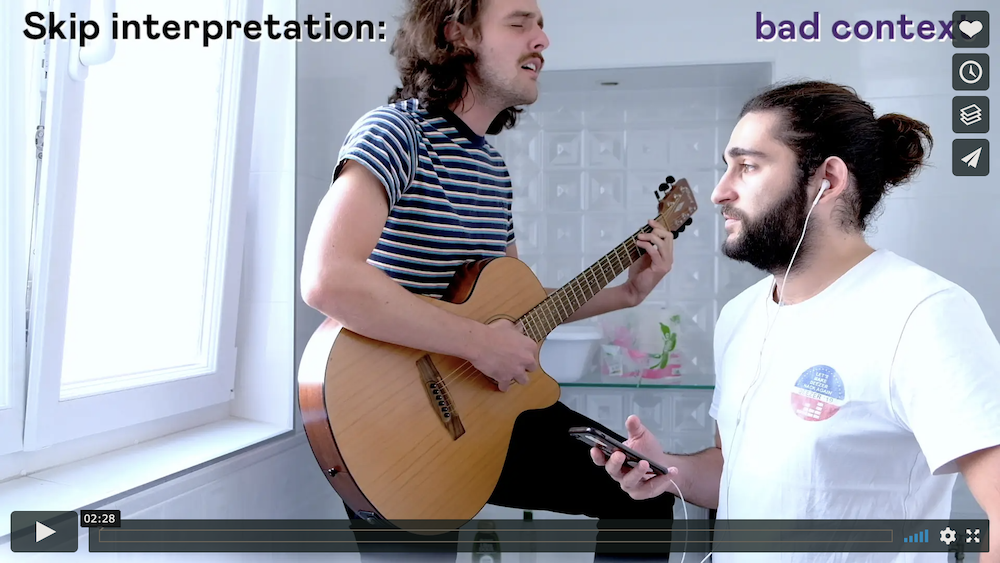
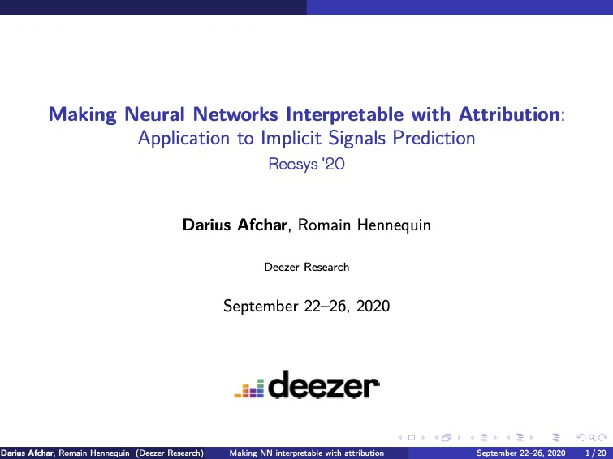
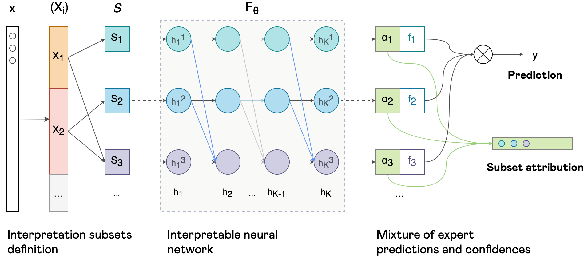
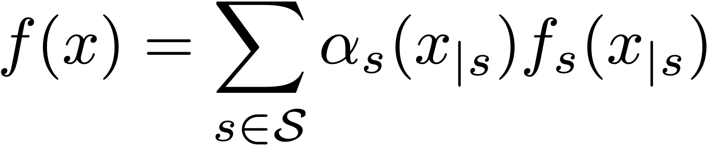

# Making neural networks interpretable with attribution: application to implicit signals prediction

Source code of our long paper [Making neural networks interpretable with attribution: application to implicit signals prediction](https://arxiv.org/abs/2008.11406) published in the proceeding of the _14th ACM Conference on Recommender Systems (RecSys 2020)_.

| <a href="https://vimeo.com/455947337">Watch our video teaser!</a>(3rd Best video teaser award)</span> | <a href="https://github.com/deezer/interpretable_nn_attribution/blob/master/data/RecSys_presentation.pdf">RecSys slides</a> |
|:-----:|:------:|
| <a href="https://vimeo.com/455947337"></a><br><span> | <a href="https://github.com/deezer/interpretable_nn_attribution/blob/master/data/RecSys_presentation.pdf"></a> |

**Abstract**
> Explaining recommendations enables users to understand whether recommended items are relevant to their needs and has been shown to increase their trust in the system. More generally, if designing explainable machine learning models is key to check the sanity and robustness of a decision process and improve their efficiency, it however remains a challenge for complex architectures, especially deep neural networks that are often deemed "black-box". In this paper, we propose a novel formulation of interpretable deep neural networks for the attribution task. Differently to popular post-hoc methods, our approach is interpretable by design. Using masked weights, hidden features can be deeply attributed, split into several input-restricted sub-networks and trained as a boosted mixture of experts. Experimental results on synthetic data and real-world recommendation tasks demonstrate that our method enables to build models achieving close predictive performances to their non-interpretable counterparts, while providing informative attribution interpretations.



<br><br>

Our method is a new intrinsic interpretation method that allows to solve the attribution task using many deep complex architectures (eg. feed-forward networks, recurrent neural networks, Transformer, ...).

We were inspired by generalised additive models and propose an extension to any multivariate experts model by formulating our predictor as a general weight sum:



For a visual comparison of our method to popular post-hoc methods, please take a look at [this quite long but we hope informative notebook](https://github.com/deezer/interpretable_nn_attribution/blob/master/toy/related_methods.ipynb).  

## Installation

```
git clone https://github.com/deezer/interpretable_nn_attribution.git
```

## Run

#### Paper toy experiments

We did upload a [notebook](https://github.com/deezer/interpretable_nn_attribution/blob/master/toy/toy_examples.ipynb) so that you can visualise all the steps.

#### Movielens experiments

`python run_movielens.py`

#### Spotify sequential skip prediction experiments

`python run_spotify.py`

#### Your experiments

We provide a general interpretable multilayered model in [models/multilayered_nn.py](https://github.com/deezer/interpretable_nn_attribution/blob/master/models/multilayered_nn.py).

The configuration of an interpretable model is task-dependent, an example is given at the end of the [toy experiment notebook](https://github.com/deezer/interpretable_nn_attribution/blob/master/toy/toy_examples.ipynb). 

## Cite

```BibTeX
@inproceedings{afchar2020making,
  title={Making Neural Networks Interpretable with Attribution: Application to Implicit Signals Prediction},
  author={Afchar, Darius and Hennequin, Romain},
  booktitle={14th ACM Conference on Recommender Systems (RecSys 2020)},
  year={2020}
}
```

## Contact

[research@deezer.com](mailto:research@deezer.com)
